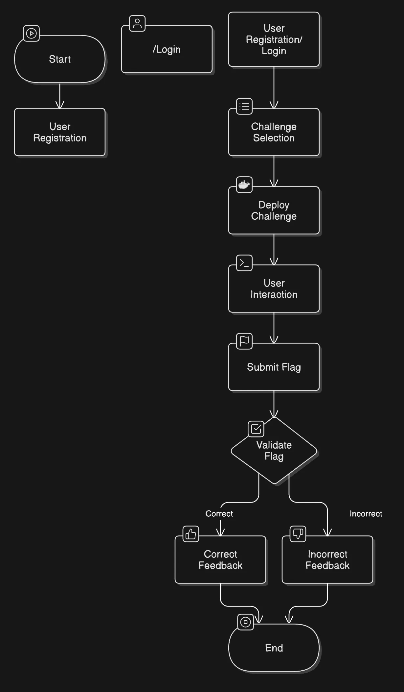
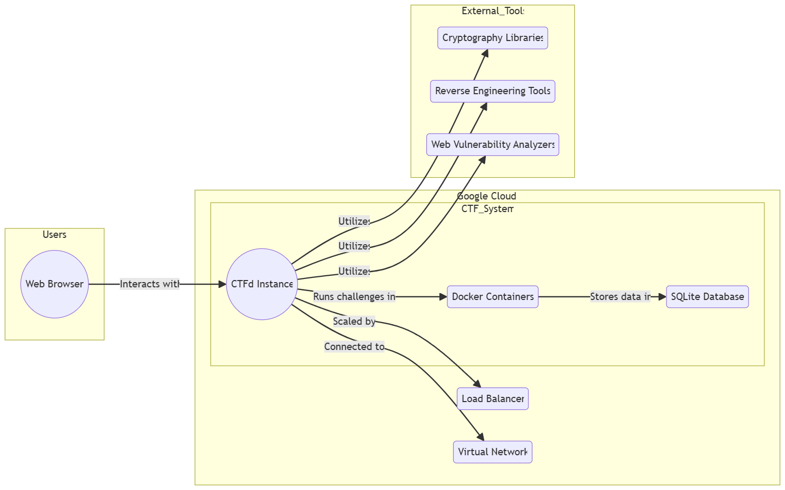

# **CTF Challenge Development and Deployment**

*Capstone Project – LMU Los Angeles, Fall 2024*

---

## **Project Overview**

### **Elevator Pitch**

We designed, implemented, and hosted 20 diverse Capture The Flag (CTF) challenges on the CTFd platform to engage and educate cybersecurity enthusiasts across various domains.

- **Who are we helping?** Cybersecurity learners and practitioners.
- **What problem are we solving?** The lack of hands-on, engaging, and realistic cybersecurity challenges.
- **How will we solve it?** By creating interactive challenges hosted on a cloud-based platform.
- **Impact:** Provides a structured learning pathway to enhance skills in cybersecurity, fostering both beginner and advanced learners.

---

## **Problem Statement**

### **The Problem**

Cybersecurity training often lacks engaging, real-world scenarios that cater to varying skill levels. Existing solutions either focus on niche areas or fail to address the diversity of skills required in the field.

### **Competitors**

While platforms like Hack The Box and TryHackMe offer similar services, they lack personalized, themed challenges catering to educational institutions.

### **Current Solutions and Challenges**

Learners face a fragmented experience with tools that do not align with structured learning, leading to wasted effort and resources.

---

## **ISBA Subfields**

- **Information Security:** Building secure challenges to mimic real-world scenarios.
- **Data Analytics:** Tracking challenge participation, analyzing user behavior, and generating insights to refine challenge difficulty and engagement.
- **Cloud Computing:** Utilizing scalable and reliable cloud-based infrastructure (Google Cloud) to host and manage challenges effectively.
---

## **Solution Overview**

We created 20 CTF challenges in the following categories, hosted on a **Google Cloud-based CTFd platform** for scalable deployment:

- **Boot2Root [2]:** Beginner-friendly root challenges.
- **Steganography [2]:** Hidden data detection challenges.
- **OSINT [2]:** Real-life web reconnaissance scenarios.
- **Cryptography [2]:** Encryption and decryption challenges.
- **Binary Exploitation [3]:** Memory-level program vulnerabilities.
- **Digital Forensics [3]:** Analyzing evidence for actionable insights.
- **Web Exploitation [3]:** Vulnerability analysis of web systems.
- **Reverse Engineering [3]:** Dissecting software for insights.

### **Technical Stack**

- **Programming Languages:** Python, Bash, HTML, JavaScript
- **Frameworks:** CTFd.io
- **Hosting Platform:** Google Cloud Platform (GCP)
- **Data Storage:** SQLite (default with CTFd)
- **Tools:** Docker for challenge deployment, Steghide, Ghidra, IDA Pro

---

## **Solution Details**

- Each challenge is deployed via Docker containers for isolation.
- Progressive hints are implemented to enhance learning while maintaining challenge integrity.
- Flags use the format: `flag{...}`
- Example flow: Users connect via the CTFd portal, engage in challenges, and submit flags to track progress.

---

## **Next Steps / Future Improvements**

1. **Automated Hints**: Incorporate AI-powered hints based on user attempts.
2. **Scale Challenges**: Add new challenge categories, such as hardware hacking.
3. **Production Deployment**: Extend beyond LMU to regional competitions.
4. **Data Insights**: Analyze participant behavior to refine challenge difficulty.

---

## **Retrospective**

### **Challenges**

- Docker orchestration for challenge scaling.
- Balancing difficulty levels across categories.

### **Key Insights**

- Learned efficient cloud hosting techniques via GCP.
- Improved understanding of diverse cybersecurity fields.

---

## Flowcharts/Diagrams of Solution Workflow

### **CTFd Portal Overview**

### **Challenge Deployment & User processing Workflow**

---
